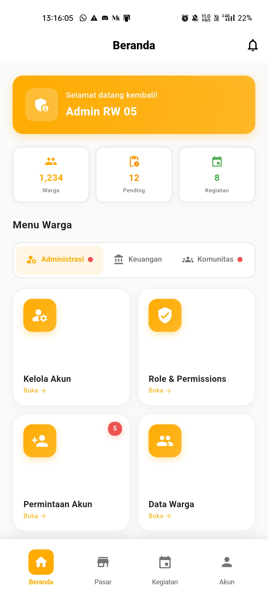

# Panduan Admin

  👤 Role: Admin

Selamat datang di panduan penggunaan aplikasi Rukunin untuk **Admin**. Sebagai admin, Anda memiliki akses penuh untuk mengelola sistem, data warga, dan seluruh aktivitas RT/RW.

## Halaman Utama

Setelah login, Anda akan melihat dashboard admin dengan informasi statistik dan akses cepat ke semua fitur:

### Komponen Dashboard

1. **Kartu Sambutan** - Menampilkan greeting dan status role Admin
2. **Statistik Ringkas** - Ringkasan jumlah warga, pending requests, dan kegiatan
3. **Menu Tab** - Akses terorganisir ke semua fitur administrasi
4. **Aktivitas Terbaru** - Monitor aktivitas terkini di sistem

### Statistik Dashboard

  

    

      👥
    

    
Total Warga

    

      Jumlah total warga terdaftar di sistem
    

  

  

    

      ⏳
    

    
Pending Requests

    

      Permintaan yang menunggu persetujuan
    

  

  

    

      📅
    

    
Kegiatan Aktif

    

      Jumlah kegiatan yang sedang berjalan
    

  

## Fitur Utama untuk Admin

### 1. 🔐 Administrasi

  

    

      👤
    

    
Kelola Akun

    

      Mengelola semua akun pengguna dalam sistem
    

  

  

    

      🔒
    

    
Role & Permissions

    

      Atur role dan hak akses setiap pengguna
    

  

  

    

      ✋
    

    
Permintaan Akun

    

      Verifikasi dan setujui pendaftaran akun baru
    

  

  

    

      📊
    

    
Data Warga

    

      Kelola database lengkap informasi warga
    

  

  

    

      ✅
    

    
Verifikasi Data

    

      Verifikasi dan validasi data warga
    

  

### 2. 💰 Keuangan

  

    

      📈
    

    
Laporan RT/RW

    

      Akses laporan keuangan dari semua RT/RW
    

  

  

    

      ✔️
    

    
Persetujuan Bendahara

    

      Setujui transaksi dan permintaan bendahara
    

  

  

    

      📅
    

    
Anggaran Tahunan

    

      Kelola dan monitor anggaran tahunan
    

  

  

    

      💳
    

    
Monitor Iuran

    

      Pantau pembayaran iuran seluruh warga
    

  

### 3. 👥 Komunitas

  

    

      📢
    

    
Persetujuan Pengumuman

    

      Review dan setujui pengumuman dari pengurus
    

  

  

    

      📅
    

    
Persetujuan Kegiatan

    

      Approve kegiatan yang diajukan pengurus
    

  

  

    

      📋
    

    
Kelola Laporan

    

      Tindak lanjuti laporan masalah dari warga
    

  

  

    

      ⚖️
    

    
Peraturan Desa

    

      Kelola peraturan dan kebijakan lingkungan
    

  

### 4. ⚙️ Sistem

  

    

      ⚙️
    

    
Pengaturan Sistem

    

      Konfigurasi pengaturan aplikasi
    

  

  

    

      📊
    

    
Analitik

    

      Lihat statistik dan insight data sistem
    

  

  

    

      📜
    

    
Log Aktivitas

    

      Monitor log aktivitas semua pengguna
    

  

  

    

      💾
    

    
Backup Data

    

      Backup dan restore data sistem
    

  

## Aktivitas Terbaru

Dashboard admin menampilkan aktivitas terbaru dalam sistem untuk memudahkan monitoring:

- **Pendaftaran warga baru** - Notifikasi real-time saat ada warga baru
- **Laporan masalah** - Alert saat ada laporan yang perlu ditindaklanjuti
- **Pengajuan kegiatan** - Notifikasi kegiatan yang menunggu approval
- **Transaksi keuangan** - Update pembayaran dan transaksi

## Langkah Selanjutnya

Pelajari lebih detail tentang setiap fitur admin:

- [Mengelola Akun Pengguna](/docs/roles/admin/account-management)
- [Verifikasi Permintaan Akun](/docs/roles/admin/account-verification)
- [Mengelola Data Warga](/docs/roles/admin/resident-data)
- [Monitor Keuangan](/docs/roles/admin/financial-monitoring)
- [Approval Pengumuman & Kegiatan](/docs/roles/admin/approval-management)
- [Pengaturan Sistem](/docs/roles/admin/system-settings)

## Tanggung Jawab Admin

:::danger Penting
Sebagai admin, Anda memiliki akses penuh ke sistem. Pastikan untuk:
- Menjaga kerahasiaan kredensial login
- Verifikasi data dengan teliti sebelum approve
- Backup data secara berkala
- Monitor aktivitas mencurigakan
- Tidak membagikan akses admin ke pihak tidak berwenang
:::

:::tip Best Practice
- Review permintaan akun baru setiap hari
- Monitor laporan keuangan secara rutin
- Tindak lanjuti laporan masalah dengan cepat
- Lakukan backup data minimal 1x seminggu
- Update peraturan dan kebijakan secara berkala
:::

## FAQ untuk Admin

**Q: Bagaimana cara menambah admin baru?**

A: Buka menu **Administrasi → Role & Permissions**, pilih akun yang akan dijadikan admin, lalu ubah role-nya.

**Q: Berapa lama permintaan akun harus diproses?**

A: Sebaiknya dalam 1x24 jam untuk menjaga kepuasan pengguna.

**Q: Apakah admin bisa menghapus data warga?**

A: Ya, tetapi disarankan untuk melakukan soft delete (arsip) daripada hard delete untuk keperluan audit.

**Q: Bagaimana cara melihat log aktivitas tertentu?**

A: Buka menu **Sistem → Log Aktivitas**, lalu gunakan filter berdasarkan tanggal, pengguna, atau jenis aktivitas.

---

**Butuh bantuan lebih lanjut?**

Hubungi tim support teknis melalui email: admin-support@rukunin.app
