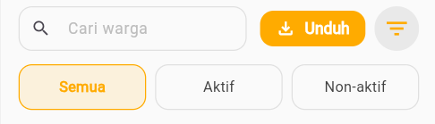

# Mengelola Data Warga

  👔 Role: Ketua RT

Panduan lengkap untuk mengelola data warga di RT Anda.

## Melihat Data Warga

  
1

  

    <h3>Akses Menu Warga</h3>
    
Dari dashboard, pilih tab <strong>Warga</strong>, lalu klik <strong>Data Warga</strong>

  

  
2

  

    <h3>Lihat Daftar</h3>
    
Anda akan melihat daftar warga dengan informasi:

    <ul>
      <li>Nama lengkap</li>
      <li>Alamat</li>
      <li>NIK</li>
      <li>No. KK</li>
      <li>Tanggal Terdaftar</li>
      <li>Peran</li>
      <li>Jenis Kelamin</li>
      <li>Status Kehidupan</li>
      <li>Tempat Lahir</li>
      <li>Tanggal Lahir</li>
      <li>Pekerjaan</li>
      <li>Status Perkawinan</li>
      <li>Pendidikan Terakhir</li>
      <li>Dokumen Pendukung (KTP & KK)</li>
    </ul>
  

### Fitur Filter & Pencarian

Gunakan filter untuk mempermudah pencarian:

- **Berdasarkan status** : Aktif, Non-aktif

## Menambah Warga Baru

  
1

  

    <h3>Klik Tambah Warga</h3>
    
Dari halaman Data Warga, klik tombol <strong>+ Tambah Warga</strong>

  

  
2

  

    <h3>Lengkapi Data Pribadi</h3>
    
Isi formulir dengan data yang valid:

    <ul>
      <li>Nama lengkap sesuai KTP</li>
      <li>NIK (pastikan valid dan belum terdaftar)</li>
      <li>No. KK</li>
      <li>Alamat Tingal</li>
      <li>Status (Anggota / Kepala Keluarga)</li>
      <li>Tempat, tanggal lahir</li>
      <li>Jenis kelamin</li>
      <li>Status perkawinan</li>
      <li>Pekerjaan</li>
      <li>Pendidikan</li>
    </ul>
  

  
3

  

    <h3>Upload Dokumen</h3>
    
Upload scan/foto dokumen:

    <ul>
      <li>KTP</li>
      <li>Kartu Keluarga</li>
    </ul>
  

  
4

  

    <h3>Simpan Data</h3>
    
Klik <strong>Simpan</strong>, sistem akan memverifikasi dan menyimpan data

  

## Mengedit Data Warga

  
1

  

    <h3>Cari Warga</h3>
    
Cari warga yang ingin diedit melalui pencarian atau filter

  

  
2

  

    <h3>Klik Edit</h3>
    
Klik tombol <strong>Edit Data</strong> pada detail warga

  

  
3

  

    <h3>Ubah Informasi</h3>
    
Edit data yang perlu diubah (alamat, kontak, pekerjaan, dll)

  

  
4

  

    <h3>Simpan Perubahan</h3>
    
Klik <strong>Simpan</strong>, sistem akan mencatat histori perubahan

  

:::warning Perhatian
Data sensitif seperti NIK dan tanggal lahir tidak bisa diubah sembarangan. Jika ada kesalahan input, hubungi admin.
:::

## Mencatat Mutasi Warga

### Warga Keluar

  
1

  

    <h3>Akses Menu Mutasi</h3>
    
Tab <strong>Warga → Catat Mutasi</strong>

  

  
2

  

    <h3>Pilih Keluarga</h3>
    
Cari dan pilih keluarga yang akan keluar

  

  
3

  

    <h3>Isi Detail Pindah</h3>
    <ul>
      <li>Tanggal pindah</li>
      <li>Alamat Lama</li>
      <li>Alasan pindah</li>
    </ul>
  

  
4

  

    <h3>Simpan</h3>
    
Status warga akan berubah menjadi <strong>Keluar</strong>

  

### Warga Pindah (Tetap di wilayah RT)

  
1

  

    <h3>Akses Menu Mutasi</h3>
    
Tab <strong>Warga → Catat Mutasi</strong>

  

  
2

  

    <h3>Pilih Keluarga</h3>
    
Cari dan pilih keluarga yang akan pindah

  

  
3

  

    <h3>Isi Detail Pindah</h3>
    <ul>
      <li>Tanggal pindah</li>
      <li>Alamat Lama</li>
      <li>Alamat Baru</li>
      <li>Alasan pindah</li>
    </ul>
  

  
4

  

    <h3>Simpan</h3>
    
Status warga akan berubah menjadi <strong>Pindah</strong>

  

## Export Data Warga

Untuk keperluan pelaporan atau backup:

1. Buka halaman **Data Warga**
2. Klik tombol **Export Data**
3. Pilih format:
   - **Excel** - Untuk analisis data
   - **PDF** - Untuk dokumentasi
   - **CSV** - Untuk import ke sistem lain
4. Pilih data yang akan di-export:
   - Semua warga
   - Warga aktif saja
   - Berdasarkan filter tertentu
5. Klik **Download**

## Tips Pengelolaan Data

:::tip Best Practice
- **Update berkala** - Minta warga update data minimal 6 bulan sekali
- **Verifikasi dokumen** - Selalu cek keaslian KTP dan KK
- **Backup rutin** - Export data setiap bulan untuk backup
- **Privasi data** - Jaga kerahasiaan data pribadi warga
- **Validasi NIK** - Pastikan NIK valid dan tidak duplikat
:::

## Troubleshooting

### NIK sudah terdaftar

**Solusi**: 
- Cek apakah warga memang sudah ada di sistem
- Jika duplikat, hubungi admin untuk pengecekan
- Pastikan NIK yang diinput benar

### Upload dokumen gagal

**Solusi**:
- Pastikan ukuran file < 2MB
- Format yang didukung: JPG, PNG, PDF
- Compress gambar jika terlalu besar

### Data tidak tersimpan

**Solusi**:
- Cek koneksi internet
- Pastikan semua field wajib sudah diisi
- Refresh halaman dan coba lagi

---

**Butuh bantuan?** Hubungi: ketua-rt-support@rukunin.app
