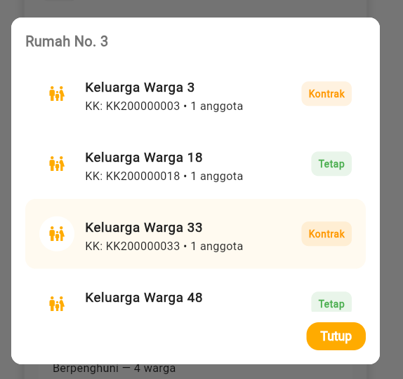

# Manajemen Wilayah RT

  👔 Role: Ketua RT

Panduan untuk melihat, menambah, dan mengelola wilayah RT beserta rumahnya.

## Daftar Wilayah RT

  
1

  

    <h3>Akses Menu Warga</h3>
    
Dari dashboard, pilih tab <strong>Warga</strong>, lalu klik <strong>Wilayah RT</strong>.

  

  
2

  

    <h3>Ringkasan Wilayah</h3>
    
Bagian atas menampilkan total wilayah yang terdaftar di RT Anda, lalu daftar wilayah beserta jumlah rumah pada masing-masing wilayah.

  

Fitur utama pada halaman ini:

- Kolom ringkas: **Nama Wilayah**, **Total Rumah**, dan **Aksi** (lihat detail / hapus).
- Tombol floating <strong>+</strong> untuk menambah wilayah baru.

## Menambah Wilayah

  
1

  

    <h3>Klik Tombol +</h3>
    
Klik tombol floating <strong>+</strong> di halaman Wilayah RT untuk membuka form tambah wilayah.

  

  
2

  

    <h3>Isi Form</h3>
    
Isi nama jalan/gang lalu klik <strong>Simpan</strong>. Wilayah akan tampil di daftar setelah berhasil disimpan.

  

## Detail Wilayah

Klik salah satu baris wilayah untuk membuka halaman detail wilayah. Halaman detail menampilkan:

1. **Nama Wilayah** (contoh: Gang Mawar)
2. **Jumlah Rumah** yang terdaftar di wilayah tersebut
3. **Daftar Rumah**, setiap entri menampilkan nomor rumah dan jumlah keluarga terdaftar

Jika daftar rumah diklik, akan muncul modal yang menampilkan daftar keluarga yang tinggal di rumah tersebut, dengan opsi filter berdasarkan **status tinggal** (Tetap / Kontrak).

## Menambah Rumah di Wilayah

  
1

  

    <h3>Klik Tombol + pada Halaman Detail Wilayah</h3>
    
Tombol floating <strong>+</strong> di halaman detail wilayah membuka form tambah rumah.

  

  
2

  

    <h3>Isi Nomor Rumah</h3>
    
Masukkan nomor rumah lalu klik <strong>Simpan</strong>. Rumah akan muncul di daftar rumah wilayah tersebut.

  

## Menghapus Wilayah

- Untuk menghapus wilayah, geser (swipe) atau gunakan aksi hapus pada baris wilayah.
- Perhatian: wilayah tidak dapat dihapus jika terdapat warga atau keluarga yang terdaftar pada jalan/gang tersebut. Sistem akan menolak penghapusan dan menampilkan pesan terkait.

## Validasi & Aturan

:::warning Perhatian
- Pastikan tidak ada rumah atau keluarga terdaftar di wilayah sebelum menghapus.
- Hanya pengurus yang memiliki hak yang boleh menambah atau menghapus wilayah.
:::

:::tip Best Practice
- Gunakan nama wilayah yang konsisten (mis. Gunakan format "Gang/ Jalan Nama") agar mudah dicari.
- Jika ada perubahan alamat besar, lakukan verifikasi warga terkait sebelum memodifikasi wilayah.
:::

## Lihat Juga

- [Mengelola Data Warga](./manage-residents)
- [Melihat Daftar Keluarga](./melihat-daftar-keluarga)

---
