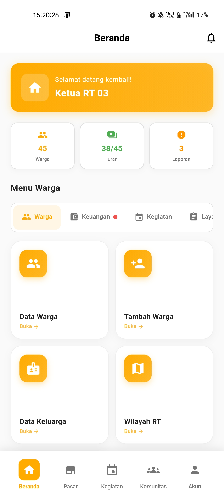

# Panduan Ketua RT

  👔 Role: Ketua RT

Selamat datang di panduan penggunaan aplikasi Rukunin untuk **Ketua RT**. Sebagai Ketua RT, Anda bertanggung jawab mengelola data warga, keuangan, dan kegiatan di wilayah RT Anda.

## Halaman Utama

Setelah login, Anda akan melihat dashboard Ketua RT dengan informasi penting:

### Komponen Dashboard

1. **Kartu Sambutan** - Menampilkan greeting dan status sebagai Ketua RT
2. **Statistik Ringkas** - Jumlah Warga, Status Iuran, dan Laporan
3. **Menu Tab** - Akses terorganisir ke semua fitur pengelolaan RT
4. **Aktivitas Terbaru** - Monitor aktivitas terkini di RT Anda

### Statistik Dashboard

  

    

      👥
    

    
Total Warga

    

      Jumlah warga terdaftar di RT Anda
    

  

  

    

      💳
    

    
Status Iuran

    

      Rasio warga yang sudah membayar iuran
    

  

  

    

      📋
    

    
Laporan Aktif

    

      Jumlah laporan yang perlu ditindaklanjuti
    

  

## Fitur Utama untuk Ketua RT

### 1. 👥 Manajemen Warga

  

    

      👥
    

    
Data Warga

    

      Lihat dan kelola data warga RT
    

  

  

    

      ➕
    

    
Tambah Warga

    

      Daftarkan warga baru ke sistem
    

  

  

    

      👨‍👩‍👧‍👦
    

    
Data Keluarga

    

      Kelola Kartu Keluarga dan anggota keluarga
    

  

  

    

      🗺️
    

    
Wilayah RT

    

      Kelola pembagian wilayah dan alamat
    

  

  

    

      🔄
    

    
Catat Mutasi

    

      Catat perpindahan warga masuk/keluar
    

  

### 2. 💰 Keuangan RT

  

    

      💳
    

    
Iuran Bulanan

    

      Kelola pembayaran iuran warga
    

  

  

    

      🏦
    

    
Kas RT

    

      Monitor kas masuk dan keluar RT
    

  

  

    

      📜
    

    
Riwayat Transaksi

    

      Lihat histori semua transaksi keuangan
    

  

### 3. 📅 Kegiatan & Rapat

  

    

      📅
    

    
Kegiatan RT

    

      Buat dan kelola kegiatan RT
    

  

  

    

      🤝
    

    
Rapat RT

    

      Jadwalkan dan kelola rapat RT
    

  

  

    

      📢
    

    
Pengumuman

    

      Kirim pengumuman ke warga RT
    

  

### 4. 📋 Layanan Warga

  

    

      📄
    

    
Pengajuan Surat

    

      Proses pengajuan surat dari warga
    

  

  

    

      🚨
    

    
Laporan Warga

    

      Tindak lanjuti laporan dari warga
    

  

  

    

      🤲
    

    
Bantuan Sosial

    

      Kelola distribusi bantuan sosial
    

  

  

    

      📊
    

    
Laporan RT

    

      Generate laporan statistik RT
    

  

## Aktivitas Terbaru

Dashboard menampilkan aktivitas real-time untuk monitoring cepat:

- **Pembayaran iuran** - Notifikasi pembayaran dari warga
- **Pengajuan surat** - Alert pengajuan surat baru
- **Laporan masalah** - Update laporan yang perlu ditindaklanjuti
- **Warga baru** - Notifikasi pendaftaran warga baru

## Langkah Selanjutnya

Pelajari lebih detail tentang setiap fitur:

- [Mengelola Data Warga](/docs/roles/ketua-rt/manage-residents)
- [Menambah Warga Baru](/docs/roles/ketua-rt/add-resident)
- [Mengelola Iuran](/docs/roles/ketua-rt/manage-dues)
- [Membuat Kegiatan RT](/docs/roles/ketua-rt/create-activity)
- [Memproses Surat](/docs/roles/ketua-rt/process-documents)
- [Menangani Laporan](/docs/roles/ketua-rt/handle-reports)

## Tanggung Jawab Ketua RT

:::tip Best Practice
Sebagai Ketua RT, Anda perlu:
- **Update data warga** secara berkala
- **Follow-up iuran** setiap bulan
- **Responsif** terhadap laporan warga (maksimal 1x24 jam)
- **Koordinasi** dengan Ketua RW dan pengurus lain
- **Transparansi** dalam pengelolaan keuangan
:::

:::warning Perhatian
- Pastikan data warga selalu akurat dan ter-update
- Catat semua transaksi keuangan dengan lengkap
- Verifikasi identitas saat menambah warga baru
- Backup data secara berkala
:::

## Tips Pengelolaan RT

### Manajemen Warga
- Lakukan pendataan ulang minimal 6 bulan sekali
- Catat mutasi warga (pindah masuk/keluar) dengan tepat
- Verifikasi KK dan KTP saat pendaftaran

### Keuangan
- Buat laporan keuangan bulanan
- Reminder iuran H-3 sebelum jatuh tempo
- Rekonsiliasi kas setiap akhir bulan

### Komunikasi
- Gunakan fitur pengumuman untuk info penting
- Balas laporan warga maksimal 1x24 jam
- Koordinasi rutin dengan pengurus RT lainnya

## FAQ untuk Ketua RT

**Q: Bagaimana cara menambah warga baru ke sistem?**

A: Buka tab **Warga → Tambah Warga**, isi formulir lengkap dengan data KTP dan KK, lalu simpan.

**Q: Bagaimana jika warga pindah keluar RT?**

A: Buka **Warga → Catat Mutasi**, pilih warga yang pindah, catat tanggal dan tujuan pindah, lalu ubah status menjadi "Pindah Keluar".

**Q: Bagaimana cara membuat laporan keuangan bulanan?**

A: Buka **Keuangan → Kas RT**, pilih periode bulan yang diinginkan, lalu klik **Generate Laporan**.

**Q: Apakah saya bisa mengedit data warga yang sudah terdaftar?**

A: Ya, buka **Warga → Data Warga**, cari warga yang dimaksud, lalu klik **Edit**.

**Q: Bagaimana cara mengirim pengingat iuran ke warga?**

A: Buka **Keuangan → Iuran Bulanan**, filter warga yang belum bayar, lalu klik **Kirim Reminder**.

---

**Butuh bantuan lebih lanjut?**

Hubungi support: ketua-rt-support@rukunin.app
