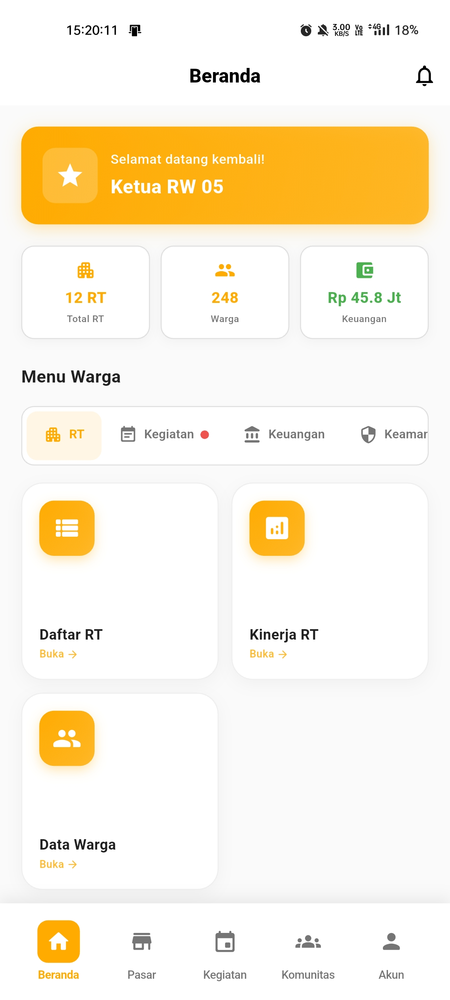

# Panduan Ketua RW

  👔 Role: Ketua RW

Selamat datang di panduan penggunaan aplikasi Rukunin untuk **Ketua RW**. Sebagai Ketua RW, Anda memiliki akses untuk mengelola seluruh RT di wilayah RW Anda.

## Halaman Utama

Setelah login, Anda akan melihat dashboard Ketua RW dengan statistik ringkas dan menu lengkap:

### Komponen Dashboard

1. **Kartu Sambutan** - Menampilkan greeting dan status sebagai Ketua RW
2. **Statistik Ringkas** - Ringkasan Total RT, Warga, dan Keuangan
3. **Menu Tab Terorganisir** - Akses ke semua fitur pengelolaan RW
4. **Aktivitas Terbaru** - Monitor aktivitas terkini di RW Anda

### Statistik Dashboard

  

    

      🏘️
    

    
Total RT

    

      Jumlah RT di bawah koordinasi RW Anda
    

  

  

    

      👥
    

    
Total Warga

    

      Jumlah warga di seluruh wilayah RW
    

  

  

    

      💰
    

    
Total Keuangan

    

      Akumulasi keuangan dari semua RT
    

  

## Fitur Utama untuk Ketua RW

### 1. 🏘️ Manajemen RT

  

    

      📋
    

    
Daftar RT

    

      Lihat dan kelola semua RT di wilayah RW
    

  

  

    

      📊
    

    
Kinerja RT

    

      Monitor dan evaluasi kinerja setiap RT
    

  

  

    

      👥
    

    
Data Warga

    

      Akses data warga dari seluruh RT
    

  

### 2. 📅 Kegiatan RW

  

    

      📅
    

    
Kegiatan RW

    

      Buat dan kelola kegiatan tingkat RW
    

  

  

    

      🤝
    

    
Rapat

    

      Jadwalkan dan kelola rapat koordinasi
    

  

  

    

      📢
    

    
Pengumuman

    

      Publikasikan pengumuman untuk seluruh warga
    

  

### 3. 💰 Keuangan

  

    

      💳
    

    
Iuran Warga

    

      Monitor pembayaran iuran dari semua RT
    

  

  

    

      📈
    

    
Ringkasan RT

    

      Lihat ringkasan keuangan per RT
    

  

  

    

      📊
    

    
Laporan

    

      Generate laporan keuangan RW
    

  

### 4. 🔒 Keamanan & Layanan

  

    

      🚨
    

    
Laporan

    

      Tindak lanjuti laporan dari warga
    

  

  

    

      📍
    

    
Monitoring

    

      Monitor keamanan wilayah RW
    

  

  

    

      📄
    

    
Surat

    

      Kelola pengajuan surat dari warga
    

  

## Aktivitas Terbaru

Dashboard menampilkan aktivitas terkini untuk memudahkan monitoring:

- **Laporan dari warga** - Notifikasi real-time laporan masalah
- **Jadwal rapat** - Pengingat rapat RT yang akan datang
- **Status iuran** - Update progress pembayaran iuran
- **Kegiatan RT** - Update kegiatan dari RT-RT

## Langkah Selanjutnya

Pelajari lebih detail tentang setiap fitur:

- [Mengelola RT](/docs/roles/ketua-rw/manage-rt)
- [Monitor Kinerja RT](/docs/roles/ketua-rw/rt-performance)
- [Membuat Kegiatan RW](/docs/roles/ketua-rw/create-activity)
- [Mengelola Keuangan](/docs/roles/ketua-rw/financial-management)
- [Menangani Laporan](/docs/roles/ketua-rw/report-handling)

## Tanggung Jawab Ketua RW

:::tip Best Practice
Sebagai Ketua RW, Anda perlu:
- **Koordinasi rutin** dengan seluruh Ketua RT
- **Monitor kinerja** setiap RT secara berkala
- **Transparansi keuangan** dalam laporan bulanan
- **Responsif** terhadap laporan dan keluhan warga
- **Fasilitasi komunikasi** antar RT
:::

:::info Informasi Penting
- Lakukan rapat koordinasi minimal 1x sebulan
- Review laporan keuangan setiap bulan
- Tindak lanjuti laporan warga maksimal 2x24 jam
- Update data warga secara berkala
:::

## FAQ untuk Ketua RW

**Q: Bagaimana cara melihat laporan keuangan semua RT?**

A: Buka tab **Keuangan → Ringkasan RT** untuk melihat laporan keuangan per RT atau **Laporan** untuk laporan konsolidasi RW.

**Q: Apakah saya bisa mengedit data RT lain?**

A: Ya, sebagai Ketua RW Anda memiliki akses untuk melihat dan mengedit data semua RT di wilayah Anda.

**Q: Bagaimana cara membuat kegiatan yang melibatkan semua RT?**

A: Buka tab **Kegiatan → Kegiatan RW**, lalu klik **Tambah Kegiatan**. Pilih semua RT sebagai peserta.

**Q: Bagaimana cara menghubungi semua Ketua RT sekaligus?**

A: Gunakan fitur **Pengumuman** atau kirim undangan **Rapat** untuk berkomunikasi dengan semua Ketua RT.

---

**Butuh bantuan lebih lanjut?**

Hubungi support: ketua-rw-support@rukunin.app
