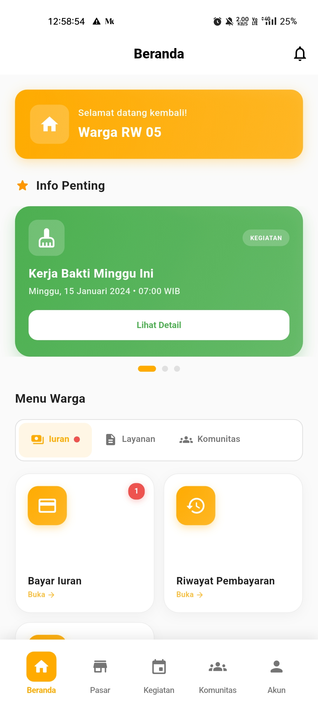

# Panduan Warga

  🏠 Role: Warga

Selamat datang di panduan penggunaan aplikasi Rukunin untuk **Warga**. Sebagai warga, Anda dapat mengakses berbagai layanan RT/RW secara digital.

## Halaman Utama

Setelah login, Anda akan melihat halaman beranda dengan informasi penting:

### Komponen Halaman Beranda

1. **Kartu Sambutan** - Menampilkan greeting dan status role Anda
2. **Carousel Informasi** - Informasi terkini tentang kegiatan, pengumuman, dan tagihan
3. **Menu Layanan** - Akses cepat ke fitur-fitur utama

## Fitur Utama untuk Warga

### 1. 💰 Iuran

  

    

      💳
    

    
Bayar Iuran

    

      Bayar iuran bulanan dengan mudah melalui aplikasi
    

  

  

    

      📜
    

    
Riwayat Pembayaran

    

      Lihat histori pembayaran iuran Anda
    

  

  

    

      🧾
    

    
Kwitansi Digital

    

      Akses kwitansi pembayaran dalam format digital
    

  

### 2. 📝 Layanan

  

    

      📄
    

    
Ajukan Surat

    

      Ajukan surat keterangan seperti SKTM, domisili, dll
    

  

  

    

      🚨
    

    
Lapor Masalah

    

      Laporkan masalah di lingkungan Anda
    

  

  

    

      💭
    

    
Kirim Saran

    

      Berikan masukan untuk pengurus RT/RW
    

  

  

    

      ✅
    

    
Status Pengajuan

    

      Pantau status pengajuan surat Anda
    

  

### 3. 👥 Komunitas

  

    

      📅
    

    
Kalender Kegiatan

    

      Lihat jadwal kegiatan dan acara warga
    

  

  

    

      📢
    

    
Pengumuman

    

      Baca pengumuman dari pengurus RT/RW
    

  

  

    

      📖
    

    
Data Warga

    

      Akses direktori warga di lingkungan Anda
    

  

  

    

      📞
    

    
Kontak Penting

    

      Daftar kontak darurat dan penting
    

  

## Langkah Selanjutnya

Pelajari lebih detail tentang setiap fitur:

- [Cara Membayar Iuran](/docs/roles/resident/payment-guide)
- [Mengajukan Surat](/docs/roles/resident/document-submission)
- [Melaporkan Masalah](/docs/roles/resident/report-issue)
- [Melihat Kegiatan](/docs/roles/resident/community-activities)

:::tip Tip Penggunaan
Aktifkan notifikasi agar Anda tidak melewatkan informasi penting dari RT/RW!
:::

:::info Informasi
Jika ada fitur yang tidak dapat diakses, hubungi admin atau pengurus RT/RW Anda untuk verifikasi akun.
:::
