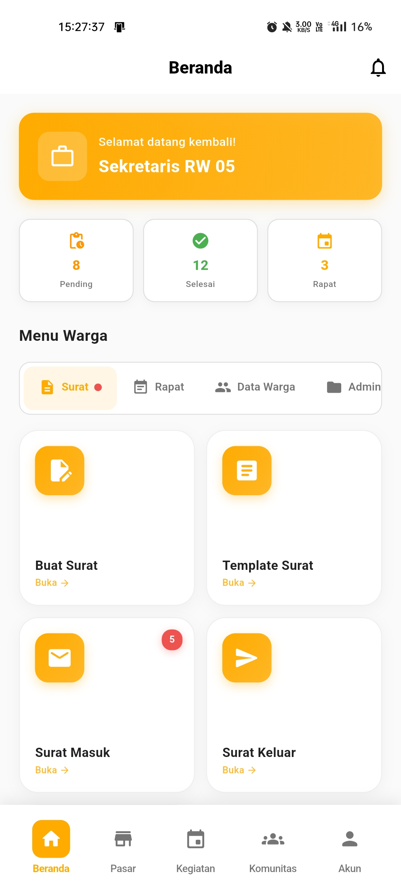

# Panduan Sekretaris

  📝 Role: Sekretaris

Selamat datang di panduan penggunaan aplikasi Rukunin untuk **Sekretaris**. Sebagai Sekretaris, Anda bertanggung jawab mengelola surat-menyurat, dokumentasi, dan administrasi RT/RW.

## Halaman Utama

Setelah login, Anda akan melihat dashboard Sekretaris dengan statistik dan akses ke fitur administrasi:

### Komponen Dashboard

1. **Kartu Sambutan** - Menampilkan greeting dan status sebagai Sekretaris
2. **Statistik Ringkas** - Surat Pending, Selesai, dan Jadwal Rapat
3. **Menu Tab** - Akses terorganisir ke semua fitur sekretariat
4. **Aktivitas Terbaru** - Monitor aktivitas dokumen dan surat terkini

### Statistik Dashboard

  

    

      ⏳
    

    
Surat Pending

    

      Jumlah surat yang menunggu diproses
    

  

  

    

      ✅
    

    
Surat Selesai

    

      Total surat yang sudah diproses bulan ini
    

  

  

    

      📅
    

    
Jadwal Rapat

    

      Jumlah rapat yang akan datang
    

  

## Fitur Utama untuk Sekretaris

### 1. 📝 Pengelolaan Surat

  

    

      ✍️
    

    
Buat Surat

    

      Buat surat keluar dengan template yang tersedia
    

  

  

    

      📄
    

    
Template Surat

    

      Kelola dan gunakan template surat
    

  

  

    

      📥
    

    
Surat Masuk

    

      Proses pengajuan surat dari warga
    

  

  

    

      📤
    

    
Surat Keluar

    

      Kelola surat keluar yang sudah dibuat
    

  

  

    

      🗄️
    

    
Arsip Surat

    

      Akses arsip surat-surat yang telah diproses
    

  

### 2. 📅 Manajemen Rapat

  

    

      📆
    

    
Jadwal Rapat

    

      Atur dan kelola jadwal rapat RT/RW
    

  

  

    

      📝
    

    
Notulensi

    

      Buat dan simpan notulen rapat
    

  

  

    

      ✉️
    

    
Undangan Rapat

    

      Kirim undangan rapat ke peserta
    

  

### 3. 👥 Data Warga

  

    

      👥
    

    
Data Warga

    

      Akses database warga untuk keperluan surat
    

  

  

    

      🆔
    

    
Surat Keterangan

    

      Proses pembuatan surat keterangan warga
    

  

### 4. 📁 Administrasi

  

    

      📊
    

    
Laporan Bulanan

    

      Generate laporan administrasi bulanan
    

  

  

    

      📂
    

    
Arsip Dokumen

    

      Kelola arsip dokumen penting RT/RW
    

  

  

    

      🕐
    

    
Riwayat Surat

    

      Lihat histori semua surat yang telah dibuat
    

  

## Aktivitas Terbaru

Dashboard menampilkan aktivitas real-time untuk monitoring cepat:

- **Persetujuan surat** - Notifikasi surat yang disetujui/ditolak
- **Dokumen baru** - Alert pengajuan dokumen dari warga
- **Jadwal rapat** - Pengingat rapat yang akan datang
- **Status surat** - Update proses surat

## Langkah Selanjutnya

Pelajari lebih detail tentang setiap fitur:

- [Membuat Surat](/docs/roles/secretary/create-letter)
- [Memproses Surat Masuk](/docs/roles/secretary/process-incoming-mail)
- [Mengelola Template](/docs/roles/secretary/manage-templates)
- [Mengatur Jadwal Rapat](/docs/roles/secretary/schedule-meeting)
- [Membuat Notulensi](/docs/roles/secretary/create-minutes)
- [Arsip Dokumen](/docs/roles/secretary/document-archive)

## Tanggung Jawab Sekretaris

:::tip Best Practice
Sebagai Sekretaris, Anda perlu:
- **Responsif** terhadap pengajuan surat (maksimal 2x24 jam)
- **Teliti** dalam pembuatan surat (cek data dan tanda tangan)
- **Terorganisir** dalam pengarsipan dokumen
- **Update notulen** segera setelah rapat selesai
- **Koordinasi** dengan Ketua RT/RW untuk approval surat
:::

:::warning Perhatian
- Verifikasi data warga sebelum membuat surat
- Pastikan format dan nomor surat sesuai ketentuan
- Simpan backup dokumen digital
- Jaga kerahasiaan dokumen warga
:::

## Tips Pengelolaan Administrasi

### Surat-Menyurat
- Gunakan template untuk efisiensi
- Nomor surat otomatis berurutan
- Arsipkan surat secara digital dan fisik
- Catat semua surat masuk dan keluar

### Rapat
- Buat agenda rapat H-3
- Kirim undangan minimal H-2
- Record notulen selama rapat
- Distribusi notulen H+1 setelah rapat

### Dokumentasi
- Scan dokumen penting
- Backup data setiap minggu
- Kategorikan arsip dengan jelas
- Buang dokumen expired sesuai ketentuan

## FAQ untuk Sekretaris

**Q: Bagaimana cara membuat surat keterangan domisili?**

A: Buka **Surat → Buat Surat**, pilih template "Surat Keterangan Domisili", isi data warga, lalu generate surat.

**Q: Apa yang harus dilakukan jika data warga tidak lengkap?**

A: Hubungi warga untuk melengkapi data atau koordinasi dengan Ketua RT untuk update data.

**Q: Bagaimana cara mengarsipkan surat yang sudah diproses?**

A: Setelah surat selesai dan ditandatangani, sistem otomatis memindahkan ke **Arsip Surat**. Anda juga bisa manual archive dari menu Surat Keluar.

**Q: Berapa lama waktu pemrosesan surat?**

A: Target maksimal 2x24 jam kerja. Untuk surat mendesak, bisa diprioritaskan.

**Q: Bagaimana jika surat perlu revisi?**

A: Klik surat yang bersangkutan, pilih **Edit**, lakukan perubahan, lalu generate ulang dengan nomor surat yang sama.

---

**Butuh bantuan lebih lanjut?**

Hubungi support: secretary-support@rukunin.app
