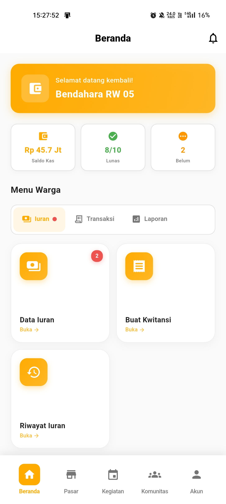

# Panduan Bendahara

  💰 Role: Bendahara

Selamat datang di panduan penggunaan aplikasi Rukunin untuk **Bendahara**. Sebagai Bendahara, Anda bertanggung jawab mengelola keuangan, iuran, dan pelaporan keuangan RT/RW.

## Halaman Utama

Setelah login, Anda akan melihat dashboard Bendahara dengan informasi keuangan:

### Komponen Dashboard

1. **Kartu Sambutan** - Menampilkan greeting dan status sebagai Bendahara
2. **Statistik Ringkas** - Saldo Kas, Status Lunas, dan Tunggakan
3. **Menu Tab** - Akses terorganisir ke semua fitur keuangan
4. **Transaksi Terbaru** - Monitor transaksi keuangan terkini

### Statistik Dashboard

  

    

      💰
    

    
Saldo Kas

    

      Total saldo kas RT/RW saat ini
    

  

  

    

      ✅
    

    
Iuran Lunas

    

      Jumlah warga yang sudah membayar iuran
    

  

  

    

      ⏳
    

    
Belum Bayar

    

      Jumlah warga yang belum membayar
    

  

## Fitur Utama untuk Bendahara

### 1. 💳 Manajemen Iuran

  

    

      💳
    

    
Data Iuran

    

      Kelola data pembayaran iuran warga
    

  

  

    

      🧾
    

    
Buat Kwitansi

    

      Generate kwitansi pembayaran digital
    

  

### 2. 💼 Manajemen Transaksi

  

    

      📋
    

    
Riwayat Transaksi

    

      Lihat semua transaksi kas RT/RW
    

  

  

    

      ⬇️
    

    
Pemasukan

    

      Catat pemasukan kas (iuran, donasi, dll)
    

  

  

    

      ⬆️
    

    
Pengeluaran

    

      Catat pengeluaran kas untuk kegiatan
    

  

### 3. 📊 Laporan Keuangan

  

    

      📊
    

    
Analisis & Grafik

    

      Visualisasi data keuangan dalam grafik
    

  

## Transaksi Terbaru

Dashboard menampilkan transaksi real-time untuk monitoring cepat:

- **Pembayaran iuran** - Notifikasi pembayaran masuk dari warga
- **Pengeluaran kas** - Alert pengeluaran yang perlu dicatat
- **Verifikasi pending** - Transaksi yang menunggu verifikasi
- **Saldo kas** - Update saldo kas real-time

## Langkah Selanjutnya

Pelajari lebih detail tentang setiap fitur:

- [Mengelola Data Iuran](/docs/roles/treasurer/manage-dues)
- [Membuat Kwitansi](/docs/roles/treasurer/create-receipt)
- [Mencatat Pemasukan](/docs/roles/treasurer/record-income)
- [Mencatat Pengeluaran](/docs/roles/treasurer/record-expense)
- [Membuat Laporan Keuangan](/docs/roles/treasurer/financial-report)
- [Analisis Keuangan](/docs/roles/treasurer/financial-analysis)

## Tanggung Jawab Bendahara

:::tip Best Practice
Sebagai Bendahara, Anda perlu:
- **Catat semua transaksi** dengan lengkap dan akurat
- **Verifikasi pembayaran** maksimal 1x24 jam
- **Buat laporan** setiap akhir bulan
- **Transparansi** dalam pengelolaan keuangan
- **Backup data** keuangan secara berkala
- **Koordinasi** dengan Ketua RT/RW untuk pengeluaran besar
:::

:::warning Perhatian
- Verifikasi bukti pembayaran sebelum approve
- Jangan lupa buat kwitansi untuk setiap transaksi
- Catat pengeluaran sesuai kategori yang benar
- Simpan bukti transaksi digital dan fisik
- Rekonsiliasi kas setiap akhir bulan
:::

## Tips Pengelolaan Keuangan

### Iuran Warga
- Set reminder otomatis H-3 sebelum jatuh tempo
- Verifikasi pembayaran segera setelah diterima
- Kirim kwitansi digital otomatis
- Follow up tunggakan setiap minggu

### Pencatatan Transaksi
- Catat transaksi setiap hari
- Kategorikan dengan benar (iuran, donasi, biaya operasional, dll)
- Upload bukti transaksi
- Buat nomor referensi unik

### Pelaporan
- Buat laporan bulanan tepat waktu
- Gunakan grafik untuk visualisasi
- Bandingkan dengan bulan sebelumnya
- Presentasikan di rapat rutin

### Keamanan
- Jangan bagikan akses ke orang lain
- Backup data minimal 1x seminggu
- Gunakan password yang kuat
- Logout setelah selesai

## FAQ untuk Bendahara

**Q: Bagaimana cara verifikasi pembayaran iuran?**

A: Buka **Iuran → Data Iuran**, pilih pembayaran yang pending, cek bukti transfer, lalu klik **Verifikasi**. Sistem akan otomatis generate kwitansi.

**Q: Bagaimana jika warga kehilangan kwitansi?**

A: Buka **Iuran → Riwayat Iuran**, cari pembayaran warga tersebut, lalu klik **Cetak Ulang Kwitansi**.

**Q: Bagaimana cara mencatat pengeluaran kas?**

A: Buka **Transaksi → Pengeluaran**, klik **Tambah Pengeluaran**, isi detail (kategori, jumlah, keterangan), upload bukti, lalu simpan.

**Q: Apa yang harus dilakukan di akhir bulan?**

A:
1. Rekonsiliasi semua transaksi
2. Generate **Ringkasan Bulanan**
3. Buat **Laporan Keuangan**
4. Presentasikan ke Ketua RT/RW
5. Backup data

**Q: Bagaimana cara mengirim reminder iuran?**

A: Buka **Iuran → Data Iuran**, filter warga yang belum bayar, klik **Kirim Reminder**. Sistem akan kirim notifikasi otomatis.

**Q: Bagaimana membuat laporan tahunan?**

A: Buka **Laporan → Laporan Keuangan**, pilih periode "Tahunan", pilih tahun, lalu klik **Generate Laporan**.

## Format Laporan Keuangan

Laporan keuangan mencakup:

### 1. Laporan Kas Masuk
- Iuran warga per bulan
- Donasi dan sumbangan
- Pemasukan lain-lain
- Total pemasukan

### 2. Laporan Kas Keluar
- Biaya operasional
- Biaya kegiatan
- Biaya pemeliharaan
- Pengeluaran lain-lain
- Total pengeluaran

### 3. Laporan Saldo
- Saldo awal bulan
- Total pemasukan bulan ini
- Total pengeluaran bulan ini
- Saldo akhir bulan

### 4. Analisis
- Perbandingan dengan bulan lalu
- Grafik pemasukan vs pengeluaran
- Proyeksi bulan depan
- Rekomendasi

---

**Butuh bantuan lebih lanjut?**

Hubungi support: treasurer-support@rukunin.app
